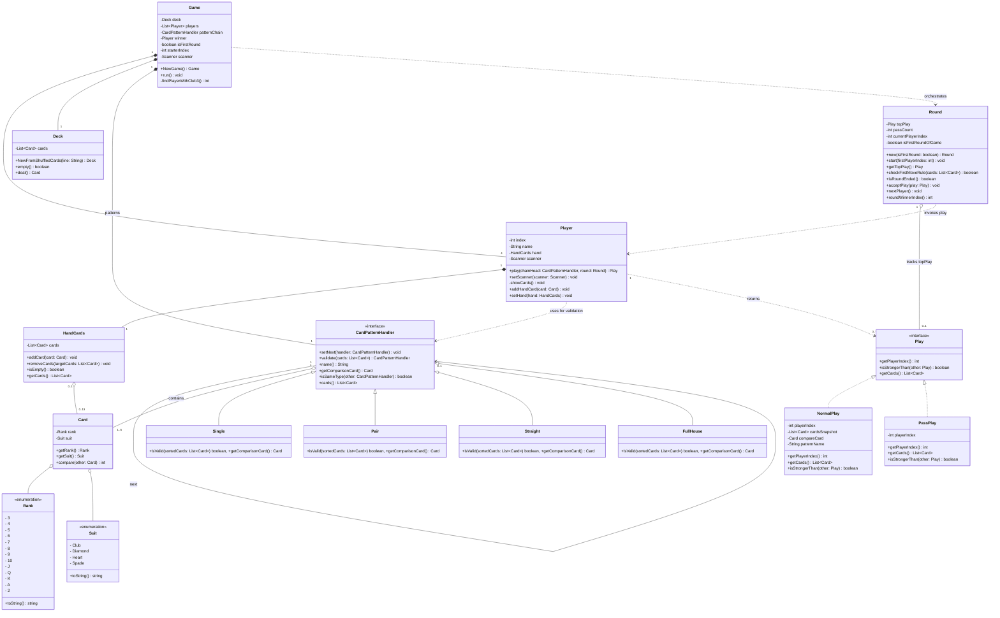

```mermaid
classDiagram
    class Game {
        -Deck deck
        -List~Player~ players
        -CardPatternHandler patternChain
        -Player winner
        -boolean isFirstRound
        -int starterIndex
        -Scanner scanner
        +NewGame() Game
        +run() void
        -findPlayerWithClub3() int
    }

    class Deck {
        -List~Card~ cards
        +NewFromShuffledCards(line: String) Deck
        +empty() boolean
        +deal() Card
    }

    class Round {
        -Play topPlay
        -int passCount
        -int currentPlayerIndex
        -boolean isFirstRoundOfGame
        +new(isFirstRound: boolean) Round
        +start(firstPlayerIndex: int) void
        +getTopPlay() Play
        +checkFirstMoveRule(cards: List~Card~) boolean
        +isRoundEnded() boolean
        +acceptPlay(play: Play) void
        +nextPlayer() void
        +roundWinnerIndex() int
    }

    class Player {
        -int index
        -String name
        -HandCards hand
        -Scanner scanner
        +play(chainHead: CardPatternHandler, round: Round) Play
        +setScanner(scanner: Scanner) void
        -showCards() void
        +addHandCard(card: Card) void
        +setHand(hand: HandCards) void
    }

    class HandCards {
        -List~Card~ cards
        +addCard(card: Card) void
        +removeCards(targetCards: List~Card~) void
        +isEmpty() boolean
        +getCards() List~Card~
    }

    class Card {
        -Rank rank
        -Suit suit
        +getRank() Rank
        +getSuit() Suit
        +compare(other: Card) int
    }

    class Suit {
        <<enumeration>>
        - Club
        - Diamond
        - Heart
        - Spade
        +toString() string
    }

    class Rank {
        <<enumeration>>
        - 3
        - 4
        - 5
        - 6
        - 7
        - 8
        - 9
        - 10
        - J
        - Q
        - K
        - A
        - 2
        +toString() string
    }

    class Play {
        <<interface>>
        +getPlayerIndex() int
        +isStrongerThan(other: Play) boolean
        +getCards() List~Card~
    }

    class NormalPlay {
        -int playerIndex
        -List~Card~ cardsSnapshot
        -Card compareCard
        -String patternName
        +getPlayerIndex() int
        +getCards() List~Card~
        +isStrongerThan(other: Play) boolean
    }

    class PassPlay {
        -int playerIndex
        +getPlayerIndex() int
        +getCards() List~Card~
        +isStrongerThan(other: Play) boolean
    }

    class CardPatternHandler {
        <<interface>>
        +setNext(handler: CardPatternHandler) void
        +validate(cards: List~Card~) CardPatternHandler
        +name() String
        +getComparisonCard() Card
        +isSameType(other: CardPatternHandler) boolean
        +cards() List~Card~
    }

    class Single { +isValid(sortedCards: List~Card~) boolean, +getComparisonCard() Card }
    class Pair { +isValid(sortedCards: List~Card~) boolean, +getComparisonCard() Card }
    class Straight { +isValid(sortedCards: List~Card~) boolean, +getComparisonCard() Card }
    class FullHouse { +isValid(sortedCards: List~Card~) boolean, +getComparisonCard() Card }

    %% 關係連結
    Game "1" *-- "4" Player
    Game "1" *-- "1" Deck
    Game "1" *-- "1" CardPatternHandler : patterns
    Game ..> Round : orchestrates

    Round "1" o-- "0..1" Play : tracks topPlay
    Round ..> Player : invokes play

    Player "1" *-- "1" HandCards
    Player ..> CardPatternHandler : uses for validation

    HandCards "0..1" o-- "0..13" Card
    Card o-- Rank
    Card o-- Suit

    Play <|.. NormalPlay
    Play <|.. PassPlay
    Player "1" ..> "0..*" Play : returns

    CardPatternHandler "1" --> "0..1" CardPatternHandler : next
    CardPatternHandler "1" o-- "1..5" Card : contains
    CardPatternHandler <|-- Single
    CardPatternHandler <|-- Pair
    CardPatternHandler <|-- Straight
    CardPatternHandler <|-- FullHouse
```
