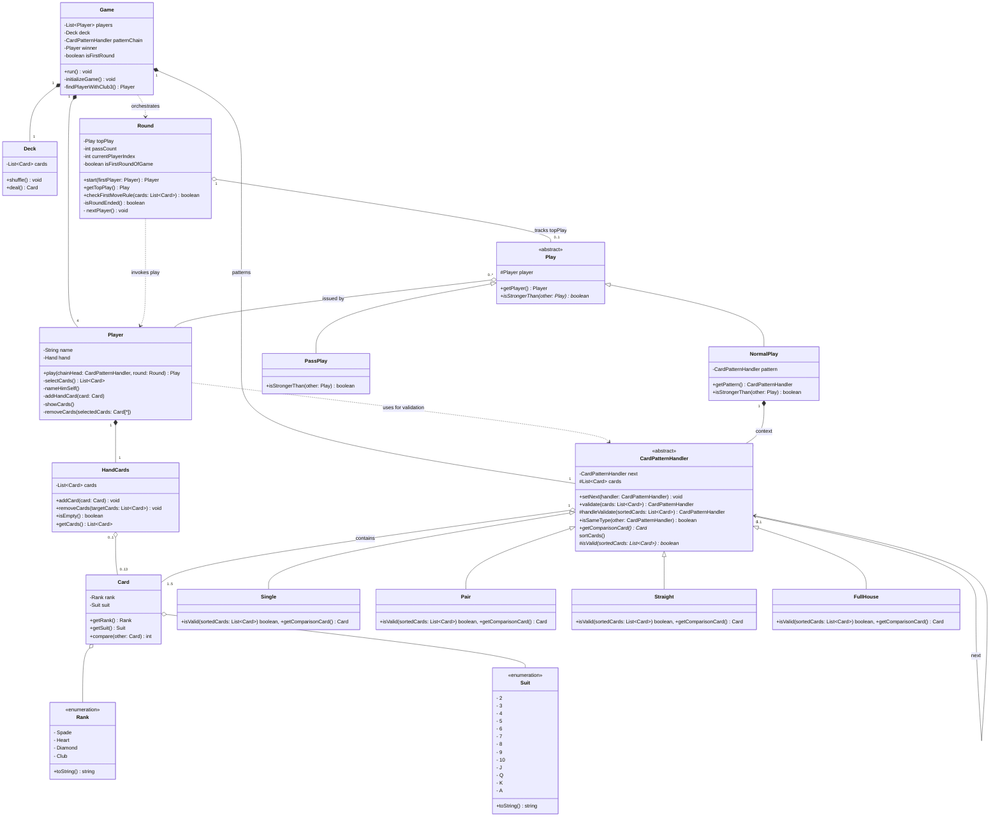

```mermaid
classDiagram
    class Game {
        -List~Player~ players
        -Deck deck
        -CardPatternHandler patternChain
        -Player winner
        -boolean isFirstRound
        +run() void
        -initializeGame() void
        -findPlayerWithClub3() Player
    }

    class Deck {
        -List~Card~ cards
        +shuffle() void
        +deal() Card
    }

    class Round {
        -Play topPlay
        -int passCount
        -int currentPlayerIndex
        -boolean isFirstRoundOfGame
        +start(firstPlayer: Player) Player
        +getTopPlay() Play
        +checkFirstMoveRule(cards: List~Card~) boolean
        -isRoundEnded() boolean
        - nextPlayer() void
    }

    class Player {
        -String name
        -Hand hand
        +play(chainHead: CardPatternHandler, round: Round) Play
        -selectCards() List~Card~
        -nameHimSelf()
        -addHandCard(card: Card)
        -showCards()
        -removeCards(selectedCards: Card[*])
    }

    class HandCards {
        -List~Card~ cards
        +addCard(card: Card) void
        +removeCards(targetCards: List~Card~) void
        +isEmpty() boolean
        +getCards() List~Card~
    }

    class Card {
        -Rank rank
        -Suit suit
        +getRank() Rank
        +getSuit() Suit
        +compare(other: Card) int
    }

    class Rank {
        <<enumeration>>
        - Spade
        - Heart
        - Diamond
        - Club
        +toString() string
    }

    class Suit {
        <<enumeration>>
        - 2
        - 3
        - 4
        - 5
        - 6
        - 7
        - 8
        - 9
        - 10
        - J
        - Q
        - K
        - A
        +toString() string
    }

    class Play {
        <<abstract>>
        #Player player
        +getPlayer() Player
        +isStrongerThan(other: Play) boolean*
    }

    class NormalPlay {
        -CardPatternHandler pattern
        +getPattern() CardPatternHandler
        +isStrongerThan(other: Play) boolean
    }

    class PassPlay {
        +isStrongerThan(other: Play) boolean
    }

    class CardPatternHandler {
        <<abstract>>
        -CardPatternHandler next
        #List~Card~ cards
        +setNext(handler: CardPatternHandler) void
        +validate(cards: List~Card~) CardPatternHandler
        #handleValidate(sortedCards: List~Card~) CardPatternHandler
        +isSameType(other: CardPatternHandler) boolean
        +getComparisonCard() Card*
        sortCards()
        #isValid(sortedCards: List~Card~) boolean*
    }

    class Single { +isValid(sortedCards: List~Card~) boolean, +getComparisonCard() Card }
    class Pair { +isValid(sortedCards: List~Card~) boolean, +getComparisonCard() Card }
    class Straight { +isValid(sortedCards: List~Card~) boolean, +getComparisonCard() Card }
    class FullHouse { +isValid(sortedCards: List~Card~) boolean, +getComparisonCard() Card }

    %% 關係連結
    Game "1" *-- "4" Player
    Game "1" *-- "1" Deck
    Game "1" *-- "1" CardPatternHandler : patterns
    Game ..> Round : orchestrates

    Round "1" o-- "0..1" Play : tracks topPlay
    Round ..> Player : invokes play

    Player "1" *-- "1" HandCards
    Player ..> CardPatternHandler : uses for validation

    HandCards "0..1" o-- "0..13" Card
    Card o-- Rank
    Card o-- Suit

    Play <|-- NormalPlay
    Play <|-- PassPlay
    Play "0..*" o-- "1" Player : issued by
    NormalPlay "1" *-- "1" CardPatternHandler : context

    CardPatternHandler "1" --> "0..1" CardPatternHandler : next
    CardPatternHandler "1" o-- "1..5" Card : contains
    CardPatternHandler <|-- Single
    CardPatternHandler <|-- Pair
    CardPatternHandler <|-- Straight
    CardPatternHandler <|-- FullHouse
```
