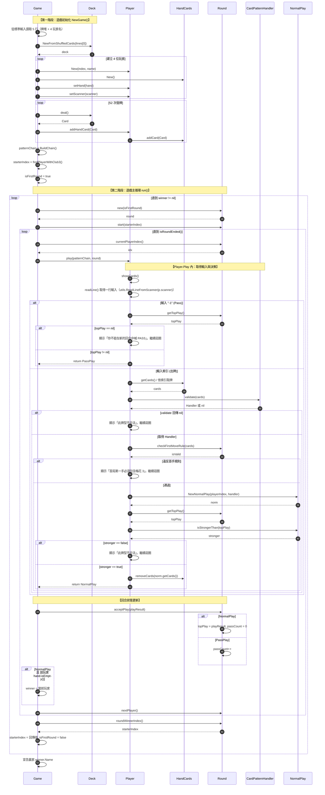

```mermaid
sequenceDiagram
    autonumber
    participant G as Game
    participant D as Deck
    participant P as Player
    participant H as HandCards
    participant R as Round
    participant CH as CardPatternHandler
    participant NP as NormalPlay

    Note over G,D: 【第一階段：遊戲初始化 NewGame()】
    G->>G: 從標準輸入讀取 5 行（牌堆 + 4 玩家名）
    G->>D: NewFromShuffledCards(lines[0])
    D-->>G: deck
    loop 建立 4 位玩家
        G->>P: New(index, name)
        G->>H: New()
        G->>P: setHand(hand)
        G->>P: setScanner(scanner)
    end
    loop 52 次發牌
        G->>D: deal()
        D-->>G: Card
        G->>P: addHandCard(Card)
        P->>H: addCard(Card)
    end
    G->>G: patternChain = BuildChain()
    G->>G: starterIndex = findPlayerWithClub3()
    G->>G: isFirstRound = true

    Note over G,R: 【第二階段：遊戲主循環 run()】
    loop 直到 winner != nil
        G->>R: new(isFirstRound)
        R-->>G: round
        G->>R: start(starterIndex)

        loop 直到 isRoundEnded()
            G->>R: currentPlayerIndex()
            R-->>G: idx
            G->>P: play(patternChain, round)

            Note over P,CH: 【Player.Play 內：取得輸入與決策】
            P->>P: showCards()
            P->>P: readLine() 取得一行輸入（utils.ReadLineFromScanner(p.scanner)）

            alt 輸入 "-1" (Pass)
                P->>R: getTopPlay()
                R-->>P: topPlay
                alt topPlay == nil
                    P->>P: 顯示「你不能在新的回合中喊 PASS」，繼續迴圈
                else topPlay != nil
                    P-->>G: return PassPlay
                end
            else 輸入索引 (出牌)
                P->>H: getCards() / 依索引取牌
                H-->>P: cards
                P->>CH: validate(cards)
                CH-->>P: Handler 或 nil

                alt validate 回傳 nil
                    P->>P: 顯示「此牌型不合法」，繼續迴圈
                else 取得 Handler
                    P->>R: checkFirstMoveRule(cards)
                    R-->>P: isValid

                    alt 違反首手規則
                        P->>P: 顯示「首局第一手必須包含梅花 3」，繼續迴圈
                    else 通過
                        P->>NP: NewNormalPlay(playerIndex, handler)
                        NP-->>P: norm
                        P->>R: getTopPlay()
                        R-->>P: topPlay
                        P->>NP: isStrongerThan(topPlay)
                        NP-->>P: stronger

                        alt stronger == false
                            P->>P: 顯示「此牌型不合法」，繼續迴圈
                        else stronger == true
                            P->>H: removeCards(norm.getCards())
                            P-->>G: return NormalPlay
                        end
                    end
                end
            end

            Note over G,R: 【回合狀態更新】
            G->>R: acceptPlay(playResult)
            alt NormalPlay
                R->>R: topPlay = playResult, passCount = 0
            else PassPlay
                R->>R: passCount++
            end
            alt NormalPlay 且 該玩家 hand.isEmpty()
                G->>G: winner = 當前玩家
            end
            G->>R: nextPlayer()
        end

        G->>R: roundWinnerIndex()
        R-->>G: starterIndex
        G->>G: starterIndex = 回傳值, isFirstRound = false
    end

    G->>G: 宣告贏家 winner.Name
```
