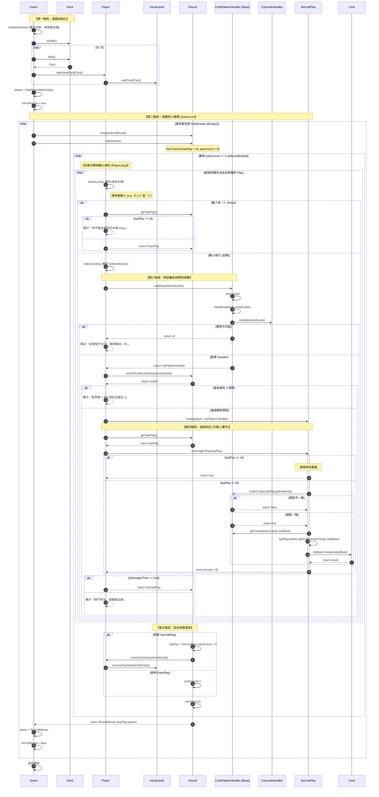

```mermaid
sequenceDiagram
    autonumber
    participant G as Game
    participant D as Deck
    participant P as Player
    participant H as HandCards
    participant R as Round
    participant CH as CardPatternHandler (Base)
    participant CCH as ConcreteHandler
    participant NP as NormalPlay
    participant Card as Card

    Note over G, D: 【第一階段：遊戲初始化】
    G->>G: initializeGame() (建立玩家、串接責任鏈)
    G->>D: shuffle()
    loop 52 次
        G->>D: deal()
        D-->>G: Card
        G->>P: addHandCard(Card)
        P->>H: addCard(Card)
    end
    G->>G: starter = findPlayerWithClub3()
    G->>G: isFirstRound = true

    Note over G, NP: 【第二階段：遊戲核心循環 (Game.run)】
    loop 直到某玩家 HandCards.isEmpty()
        G->>R: create(isFirstRound)
        G->>R: start(starter)
        Note over R: New Round (topPlay = nil, passCount = 0)

        loop 直到 passCount == 3 (isRoundEnded)
            Note over P: 【玩家決策與輸入解析 (Player.play)】
            loop 直到回傳合法且足夠強的 Play
                P->>P: showCards() (顯示目前手牌)
                Note right of P: 使用者輸入 (e.g. "0 1 2" 或 "-1")

                alt 輸入為 "-1" (Pass)
                    P->>R: getTopPlay()
                    alt topPlay == nil
                        P-->>P: 顯示「你不能在新回合中喊 Pass」
                    else
                        P-->>R: return PassPlay
                    end
                else 輸入索引 (出牌)
                    P->>P: selectCards() (獲取 selectedCards)

                    Note over P, CH: 【第三階段：牌型鑑定與規則校驗】
                    P->>CH: validate(selectedCards)
                    CH->>CH: sortCards()
                    CH->>CH: handleValidate(sortedCards)
                    CH->>CCH: isValid(sortedCards)

                    alt 牌型不匹配
                        CH-->>P: return nil
                        P-->>P: 顯示「此牌型不合法，請再嘗試一次。」
                    else 取得 Handler
                        CH-->>P: return myPatternHandler

                        P->>R: checkFirstMoveRule(selectedCards)
                        R-->>P: return isValid

                        alt 違反梅花 3 規則
                            P-->>P: 顯示「首局第一手必須包含梅花 3」
                        else 通過開局規則
                            P->>NP: create(player, myPatternHandler)

                            Note over P, NP: 【第四階段：強弱判定 (方案二實作)】
                            P->>R: getTopPlay()
                            R-->>P: return topPlay

                            P->>NP: isStrongerThan(topPlay)
                            activate NP
                            alt topPlay == nil
                                Note over NP: 直接視為最強
                                NP-->>P: return true
                            else topPlay != nil
                                NP->>CH: isSameType(topPlay.getPattern())
                                alt 牌型不一致
                                    CH-->>NP: return false
                                else 牌型一致
                                    CH-->>NP: return true
                                    NP->>CH: getComparisonCard() (myBase)
                                    NP->>NP: topPlay.pattern.getComparisonCard() (topBase)
                                    NP->>Card: myBase.compare(topBase)
                                    Card-->>NP: return result
                                end
                                NP-->>P: return (result > 0)
                            end
                            deactivate NP

                            alt isStrongerThan == true
                                P-->>R: return NormalPlay
                            else
                                P-->>P: 顯示「牌不夠大，請重新出牌」
                            end
                        end
                    end
                end
            end

            Note over R, H: 【第五階段：回合狀態更新】
            alt 收到 NormalPlay
                R->>R: topPlay = NormalPlay, passCount = 0
                R->>P: removeCards(selectedCards)
                P->>H: removeCards(selectedCards)
            else 收到 PassPlay
                R->>R: passCount++
            end
            R->>R: nextPlayer()
        end
        R-->>G: return RoundWinner (topPlay.player)
        G->>G: starter = RoundWinner
        G->>G: isFirstRound = false
    end
    G->>G: 宣告贏家
```
